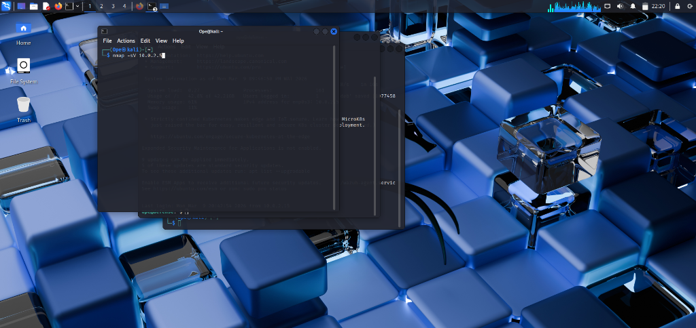
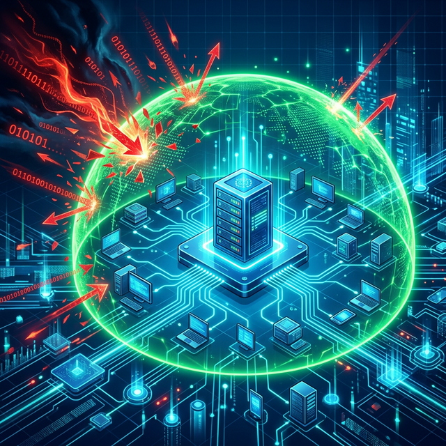
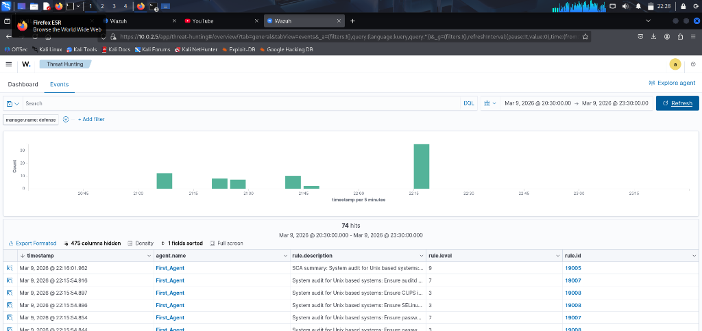
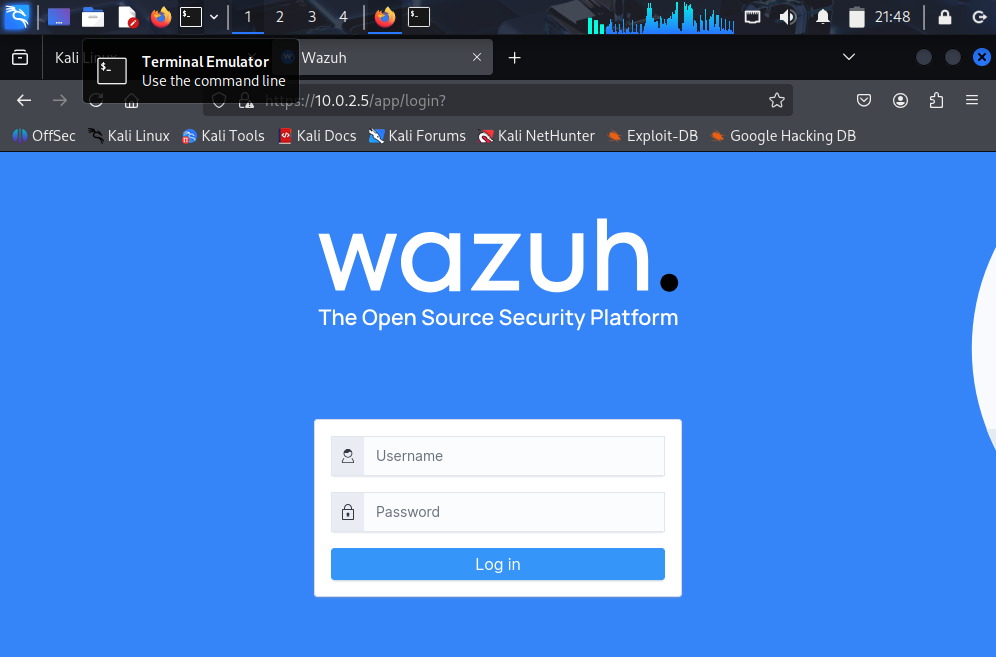
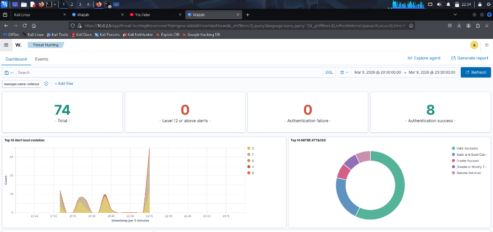
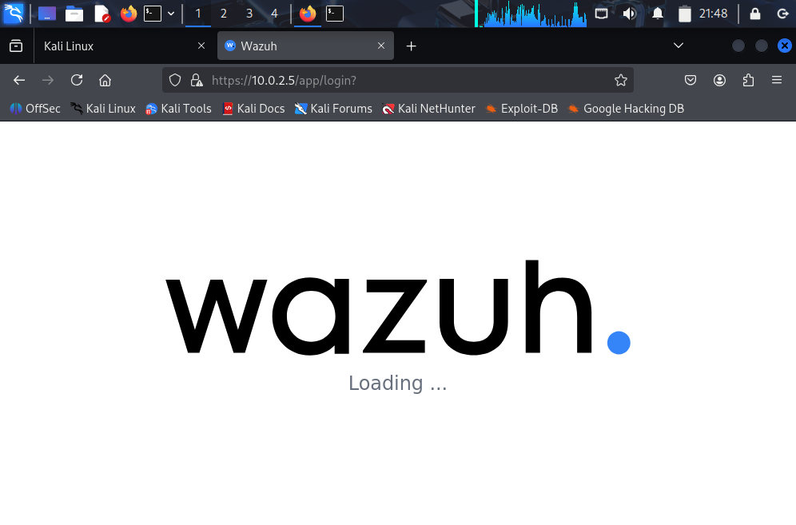

# 🛡️ Building a Professional SOC Home Lab: Wazuh SIEM & Threat Detection

## 🎯 Project Overview
This project documents the end-to-end architecture and deployment of a **Security Operations Center (SOC) home lab**. The primary objective was to establish a centralized monitoring ecosystem capable of detecting, analyzing, and automatically responding to security threats. This lab simulates a realistic corporate environment encompassing a SIEM manager, an attacker node, and a hardened Windows endpoint.

**Key Skills Demonstrated:** SIEM Engineering, Log Aggregation, Endpoint Detection & Response (EDR), Automated Incident Response, and System Hardening.

## 🛠️ Technology Stack & Environment
- **SIEM/EDR Platform**: Wazuh (Indexer, Server, Dashboard)
- **Endpoint Telemetry**: Wazuh Agent, Microsoft Sysmon (Windows)
- **Virtualization Infrastructure**: Oracle VirtualBox
- **Offensive Tooling**: Kali Linux (Nmap, Hydra)
- **Operating Systems**: Ubuntu Server 24.04 LTS, Windows 11 Home, Kali Linux 2024.x

## 🚀 Key Milestones & "The Win"

### 1. SIEM Infrastructure Deployment & Logging Pipeline
Successfully deployed a distributed Wazuh architecture on a resource-constrained Ubuntu Server, engineering the system for high availability and log volume scaling.
- **Storage Engineering**: Expanded a 12GB LVM partition to 50GB dynamically to support high-volume, continuous log ingestion.
- **Service Optimization**: Resolved critical port conflicts (1515/55000) and automated `needrestart` configurations to ensure 24/7 SIEM uptime.

### 2. Deep Endpoint Visibility & Telemetry (Sysmon)
Integrated a Windows 11 endpoint with **Sysmon** and the Wazuh agent to achieve process-level execution visibility, moving beyond standard Windows Event Logs.
- **Threat Detection**: Successfully detected suspicious surrogate injections (`dllhost.exe`) and anomalous service executions (`svchost.exe`).
- **Audit Compliance**: Executed a **CIS Benchmark** Security Configuration Assessment (SCA), identifying and baselining security misconfigurations against industry standards.

### 3. Automated Threat Containment (Active Response)
Progressed the lab from passive "Alerting" to active "Protecting" by configuring Wazuh Active Response.
- **Attack Scenario**: Simulated a persistent SMB brute-force attack originating from Kali Linux using Hydra (Mapped to *MITRE ATT&CK T1110*).
- **Automated Response**: Upon detecting **Level 12** authentication anomalies, Wazuh automatically triggered a firewall block via `netsh.exe` on the endpoint, neutralizing the threat vector within 60 seconds.

## 📊 Detection Portfolio (Key Alerts)

| Alert Level | Threat Description | Telemetry Source | MITRE Framework |
| :--- | :--- | :--- | :--- |
| **Level 13** | Brute Force Attack detected on Windows | Wazuh Manager | T1110 (Brute Force) |
| **Level 12** | Suspicious Process (`dllhost.exe`) execution | Sysmon | T1055 (Process Injection) |
| **Level 3** | New Account Discovery (`net.exe`) | Windows Security Logs | T1087 (Account Discovery) |
| **Active** | Automated Firewall Block (Rule 607) | Active Response | D3-IAC (Isolate) |

## 💡 Lessons Learned & Operational Takeaways
- **Infrastructure Troubleshooting as a Security Skill**: Resolving Hyper-V and VirtualBox "Critical Errors" provided deep insights into host-level virtualization security and resource allocation.
- **Telemetry is King**: A SIEM is only as powerful as the data it parses. Deploying Sysmon proved essential for tracing the *actual* execution chain of processes, rather than just the generic Windows audit logs.

## 🖼️ Technical Gallery (The Journey)

Below is a collection of captures showcasing the evolution of the lab, from initial connectivity tests to full-scale attack simulation and autonomous defense.

| Description | Evidence Capture |
| :--- | :--- |
| **Initial Kali Scan Verification** |  |
| **Wazuh Agent Deployment Logs** |  |
| **Windows Security Event Ingestion** |  |
| **Sysmon Process Monitoring (Deep Dive)** |  |
| **Active Response Configuration Check** |  |

---
*Architected and Documented by Opeyemi Benjamin — Aspiring SOC Analyst.*
